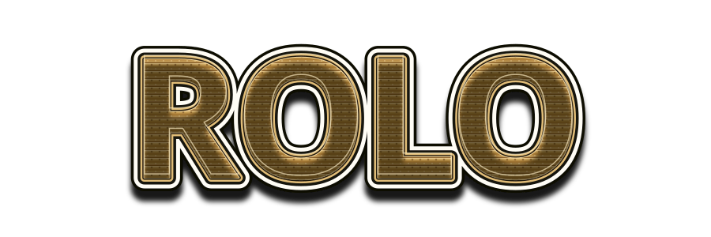
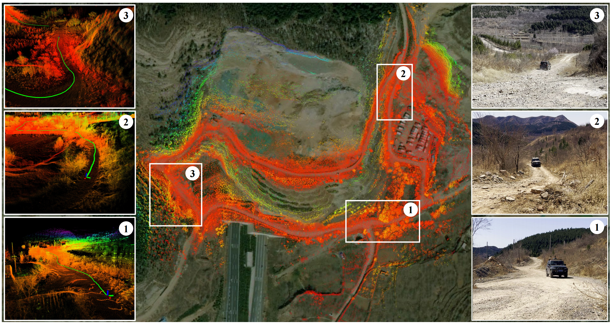
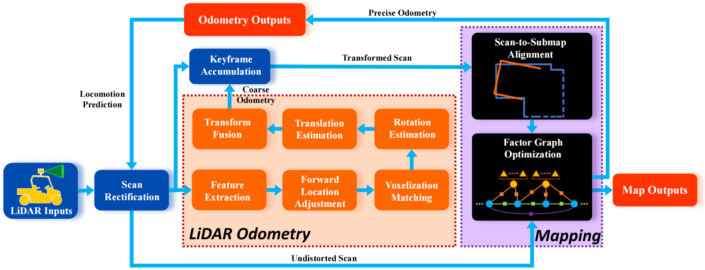
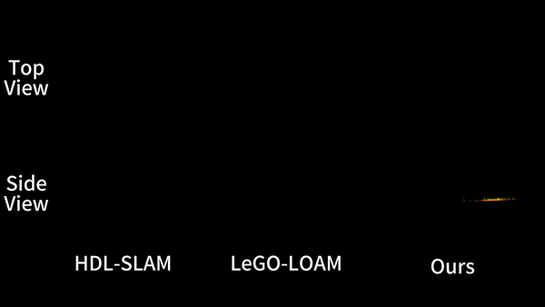

<div align="center">

<!-- Adjust width (or add height) here to resize the title artwork. -->



<p>
  A robust LiDAR-based SLAM system designed for ground-vehicle in rough and challenging environments.
</p>

<p>
  <a href="#installation"><b>Installation</b></a> ·
  <a href="#quick-start"><b>Quick Start</b></a> ·
  <a href="#test-data"><b>Test Data</b></a> ·
  <a href="#todo"><b>Roadmap</b></a> ·
  <a href="#citation"><b>Citation</b></a>
</p>

<p>
  
  
  
  
</p>



</div>

---

## Overview

<div align="center">
  
  <br>
  <sub>System overview of the ROLO pipeline.</sub>
</div>

## Installation

### Requirements

The following configurations have been tested:

| Component | Version |
|---|---|
| ROS |      |
| CMake | ≥ 3.0.2 |
| OpenCV | ≥ 4.10.0 |
| GTSAM | ≥ 4.2.0 |
| Boost | ≥ 1.71 |
| PCL | ≥ 1.10.0 |
| Eigen | ≥ 3.3.7 |
| glog  | ≥ 0.4.0 |
| OpenVDB (Optional) | ≥ 9.1.0 (Noetic) |

ROS dependencies include `autoware_rviz_msgs`, `cv_bridge`, `geometry_msgs`, `jsk_recognition_msgs`, `nav_msgs`, `pcl_ros`, `sensor_msgs`, `std_msgs`, `tf`, `tf2`, and `visualization_msgs`.

### Build from source

Create a catkin workspace, clone this repository into its `src` directory, and build the workspace:

```bash
mkdir -p ~/rolo_ws/src && cd ~/rolo_ws/src
git clone https://github.com/sdwyc/ROLO.git
cd ..
catkin_make
source devel/setup.bash
```

## Quick Start

### 1. Configuration

Generally, ROLO only accepts point clouds as `sensor_msgs/PointCloud2` messages. (Only support Velodyne, Ouster LiDAR.)

The IMU messages `sensor_msgs/Imu` is optional for accracy improvement in scan deskewing and loose-coupling pose estimation. (IMU -> LiDAR extrinsics is recommended, but ROLO is insensitive to extrinsics.)

Open [`config/params.yaml`](config/params.yaml) and set the point-cloud topic and sensor-related parameters for your platform. The launch file uses the `/base_link` and `/velodyne` frames by default; adjust the static transform in [`launch/rolo_run.launch`](launch/rolo_run.launch) when your frame names or extrinsics differ.

### 2. Launch ROLO System

```bash
source ~/rolo_ws/devel/setup.bash
roslaunch rolo rolo_run.launch
```

### 3. Play a ROS bag

Makesure point cloud topic is in your bag file!

```bash
rosbag play /path/to/your-bag.bag --clock
```

## Test Data (deprecated)

An off-road example ROS bag, which is available on [Google Drive](https://drive.google.com/file/d/1Xv8KFIYnK_ETduEiaSFqfBQGXi_yWvf88/view?usp=drive_link) (approximately 7 minutes and 8.9 GB). 

> [!NOTE]
> The example bag involves data sensitivity problem. Deprecated temporarily.

## Results

<div align="center">
  
  <br>
  <sub>Qualitative comparison in challenging terrain.</sub>
</div>

## Todo

The following items summarize the current public roadmap:

- [x] Add SGD-based rotation registration
- [x] Add prior pose association and scan-context loop detection
- [x] Add IMU support
- [x] Refine the core code structure
- [ ] Add ROS 2 support
- [ ] Provide additional dataset-specific configurations


Contributions and suggestions are welcome through [GitHub Issues](https://github.com/sdwyc/ROLO/issues).

## Citation

If ROLO is useful in your research, please cite:

```bibtex
@article{wang2025rolo,
  title={ROLO-SLAM: rotation-optimized LiDAR-only SLAM in uneven terrain with ground vehicle},
  author={Wang, Yinchuan and Ren, Bin and Zhang, Xiang and Wang, Pengyu and Wang, Chaoqun and Song, Rui and Li, Yibin and Meng, Max Q-H},
  journal={Journal of Field Robotics},
  volume={42},
  number={3},
  pages={880--902},
  year={2025},
  publisher={Wiley Online Library}
}
```

## Acknowledgements
This project builds on ideas and open-source software from:

- [LIO-SAM](https://github.com/TixiaoShan/LIO-SAM) — T. Shan, B. Englot, D. Meyers, W. Wang, C. Ratti, and D. Rus, “LIO-SAM: Tightly-coupled Lidar Inertial Odometry via Smoothing and Mapping,” *IEEE/RSJ IROS*, 2020.
- [FastGICP](https://github.com/SMRT-AIST/fast_gicp) — K. Koide, M. Yokozuka, S. Oishi, and A. Banno, “Voxelized GICP for Fast and Accurate 3D Point Cloud Registration,” *IEEE ICRA*, 2021.
- [Scan Context](https://github.com/gisbi-kim/scancontext) — Kim G, Choi S, Kim A. Scan context++: Structural place recognition robust to rotation and lateral variations in urban environments[J]. IEEE Transactions on Robotics, 2021, 38(3): 1856-1874.

We sincerely thank the authors and maintainers of these projects.

## License

This project is released under the [MIT License](https://opensource.org/licenses/MIT).

---

<div align="center">
  <sub>If you find this project helpful, consider giving it a ⭐.</sub>
</div>
